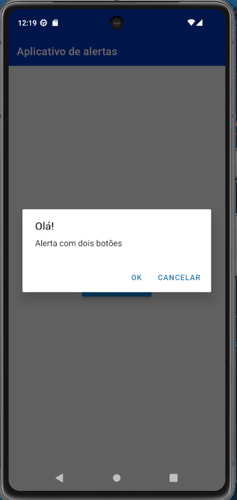

# 📱 App de Alertas Sorteados (React Native)

Este projeto simples demonstra o uso da API nativa `Alert` do React Native para exibir diferentes tipos de caixas de diálogo de forma aleatória. É uma atividade básica para praticar o uso dos alertas nativos com 1, 2 ou 3 botões e a lógica de seleção aleatória (`Math.random`).

## ✨ Funcionalidades

O aplicativo possui uma função principal que sorteia e exibe um dos seguintes alertas:

- **Alerta Simples:** Possui apenas o botão "OK".

- **Alerta com Dois Botões:** Possui as opções "Ok" e "Cancelar".

- **Alerta com Três Botões:** Possui opções personalizadas (ex: "Sim", "Não", "Pergunte-me depois").

## Tela do app



## 🚀 Como Rodar (Executar) o Projeto

Este projeto utiliza o ambiente React Native padrão, sendo ideal para rodar com o **Expo**.

1. Instalar dependencias

   ```bash
   npm install
   ```

2. iniciar app

   ```bash
   npx expo start
   ```

3. O **Metro Bundler** será iniciado, exibindo um QR Code.

4. Use o aplicativo **Expo Go** no seu celular para escanear o QR Code, ou abra o projeto em um simulador (iOS/Android).

5. O aplicativo será carregado. Clique no botão **"Sortear Alerta"** para ver os diferentes tipos de alertas sendo exibidos aleatoriamente.
