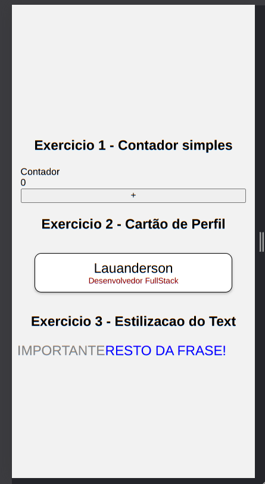

## Atividades Práticas: RN

Objetivo

1 - Criar um contador simples que utiliza o `useState` para gerenciar o valor e o `useEffect` para reagir a mudanças no estado, fornecendo um feedback visual.

2 - Criar um componente de Card com props nome e cargo

3 - Criar um estilizacao hierarquica em um Text

## Imagem do app:

