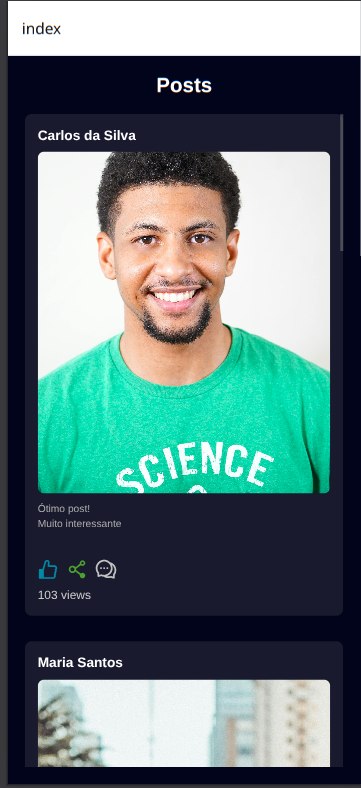

# Bem vindo ao Expo 👋

Este é um app [Expo](https://expo.dev) criado com [`create-expo-app`](https://www.npmjs.com/package/create-expo-app).

## Como rodar

1. Instalar dependencias

   ```bash
   npm install
   ```

2. iniciar app

   ```bash
   npx expo start
   ```

3. Subir api fake

   ```bash
   npx json-server db.json
   ```

## Tela do app


